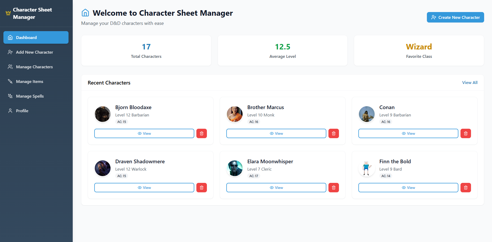
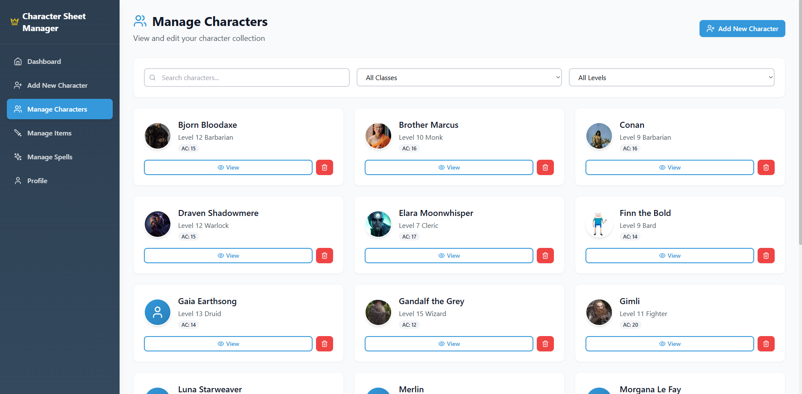
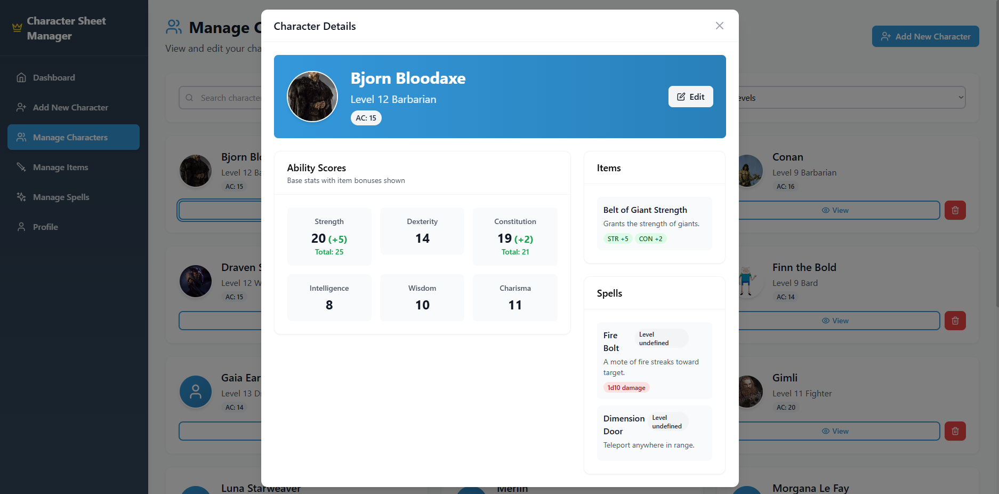
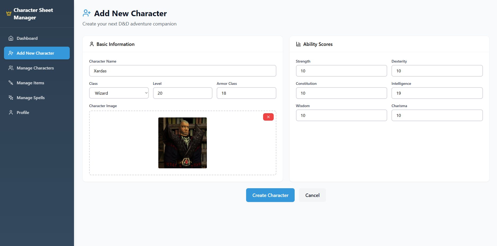
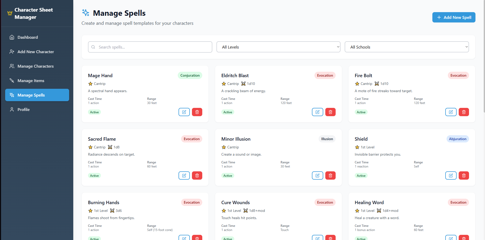
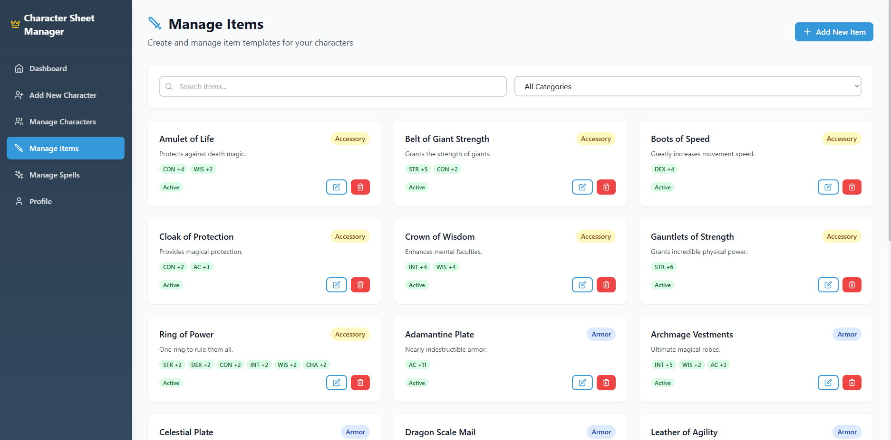
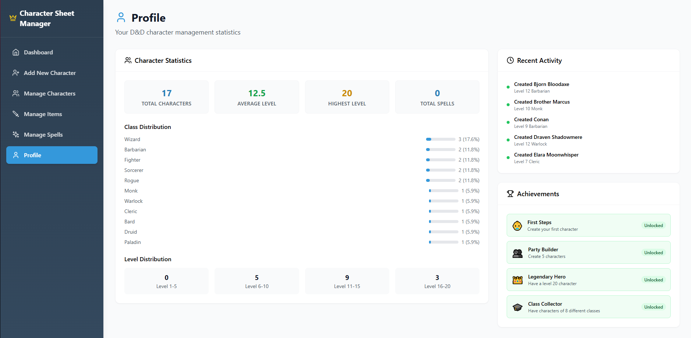

# D&D Character Manager Frontend

A modern, responsive React application for managing D&D character sheets, built with TypeScript, Tailwind CSS, and cutting-edge web technologies.

## 🌟 Features

- **Character Management**: Create, view, edit, and delete D&D characters with full stat tracking
- **Interactive Character Cards**: Beautiful character displays with avatars and stat overviews
- **Real-time Updates**: Seamless data synchronization with React Query
- **Form Validation**: Comprehensive form validation with React Hook Form and Zod
- **Modern UI**: Clean, professional interface with Tailwind CSS and Framer Motion animations
- **Type Safety**: Full TypeScript support for robust development
- **Hot Reload**: Lightning-fast development with Vite and SWC

## 🚀 Tech Stack

- **React 18** - Modern React with hooks and concurrent features
- **TypeScript** - Type-safe development
- **Vite** - Ultra-fast build tool and development server
- **SWC** - Super fast TypeScript/JavaScript compiler
- **Tailwind CSS** - Utility-first CSS framework
- **React Query** - Data fetching and state management
- **React Hook Form** - Performant forms with easy validation
- **Zod** - TypeScript-first schema validation
- **React Router** - Client-side routing
- **Framer Motion** - Smooth animations and transitions
- **Lucide React** - Beautiful, customizable icons
- **React Hot Toast** - Elegant notifications

## 📋 Prerequisites

- [Node.js](https://nodejs.org/) (v18 or higher)
- [npm](https://www.npmjs.com/) or [yarn](https://yarnpkg.com/)

## 🛠️ Installation & Setup

1. **Clone the repository**
   ```bash
   git clone <repository-url>
   cd frontend
   ```

2. **Install dependencies**
   ```bash
   npm install
   # or
   yarn install
   ```

3. **Configure environment**
   
   The app is configured to proxy API requests to `http://localhost:5126`. Update `vite.config.ts` if your backend runs on a different port:
   ```typescript
   server: {
     proxy: {
       '/api': {
         target: 'http://localhost:5126', // Update this URL
         changeOrigin: true,
       },
     },
   }
   ```

4. **Start the development server**
   ```bash
   npm run dev
   # or
   yarn dev
   ```

5. **Open your browser**
   ```
   http://localhost:3000
   ```

## 📱 Application Screenshots

### Dashboard


### Character List


### Character Details


### Create Character Form


### Spell Management


### Item Management


### Overview and Statistics


## 🏗️ Project Structure

```
src/
├── components/           # Reusable UI components
│   ├── character/       # Character-specific components
│   ├── items/           # Item management components
│   ├── layout/          # Layout components (navbar, sidebar)
│   ├── spells/          # Spell management components
│   └── ui/              # Generic UI components
├── hooks/               # Custom React hooks
├── lib/                 # Utility functions and configurations
├── pages/               # Page components (routes)
├── services/            # API service functions
├── types/               # TypeScript type definitions
├── assets/              # Static assets
└── App.tsx              # Main application component
```

## 🎯 Key Features

### Character Cards
Beautiful, interactive character cards displaying:
- Character avatar (custom or default)
- Name, class, and level
- Armor class badge
- Action buttons for viewing and deleting

### Form Management
- Type-safe forms with React Hook Form
- Real-time validation with Zod schemas
- Intuitive error messaging
- Auto-save capabilities

### Data Management
- Optimistic updates for better UX
- Automatic cache invalidation
- Loading states and error handling
- Offline support with query caching

## ⚙️ Configuration

### Tailwind Configuration
```javascript
// tailwind.config.js
export default {
  content: ["./index.html", "./src/**/*.{js,ts,jsx,tsx}"],
  theme: {
    extend: {
      colors: {
        primary: {
          50: '#f0f8ff',
          500: '#3498db',
          700: '#2c3e50',
        },
        sidebar: {
          dark: '#2c3e50',
          darker: '#34495e',
        },
      },
    },
  },
}
```

### TypeScript Configuration
```json
// tsconfig.json
{
  "compilerOptions": {
    "target": "ES2020",
    "lib": ["ES2020", "DOM", "DOM.Iterable"],
    "module": "ESNext",
    "strict": true,
    "jsx": "react-jsx",
    "baseUrl": ".",
    "paths": {
      "@/*": ["./src/*"]
    }
  }
}
```

## 🔧 Available Scripts

```bash
npm run dev          # Start development server
npm run build        # Build for production
npm run preview      # Preview production build
npm run lint         # Run ESLint
```

## 🎨 Component Examples

### Character Card Component
```typescript
interface CharacterCardProps {
  character: CharacterSummary;
  onView: (id: number) => void;
  onDelete: (id: number) => void;
}

export const CharacterCard: React.FC<CharacterCardProps> = ({
  character,
  onView,
  onDelete,
}) => {
  return (
    <Card hover className="h-full">
      <CardBody>
        {/* Character avatar and info */}
        {/* Action buttons */}
      </CardBody>
    </Card>
  );
};
```

### Custom Hooks
```typescript
// useCharacters hook for data fetching
export const useCharacters = () => {
  return useQuery({
    queryKey: ['characters'],
    queryFn: characterService.getAll,
    staleTime: 5 * 60 * 1000, // 5 minutes
  });
};
```

## 🚀 Deployment

### Build for Production
```bash
npm run build
```

## 🔍 Performance Optimizations

- **Code Splitting**: Automatic route-based code splitting
- **Tree Shaking**: Unused code elimination
- **Image Optimization**: Base64 image caching and optimization
- **Bundle Analysis**: Built-in bundle size analysis
- **Lazy Loading**: Component lazy loading for better performance

## 🌐 Browser Support

- Chrome/Edge (last 2 versions)
- Firefox (last 2 versions)  
- Safari (last 2 versions)

## 🎯 Future Enhancements

- **Dark Mode**: Theme switching capability
- **Offline Mode**: Progressive Web App features
- **Character Sharing**: Export/import character data
- **Dice Rolling**: Integrated dice roller
- **Campaign Management**: Multi-character campaigns
- **Real-time Collaboration**: Share characters with party members
